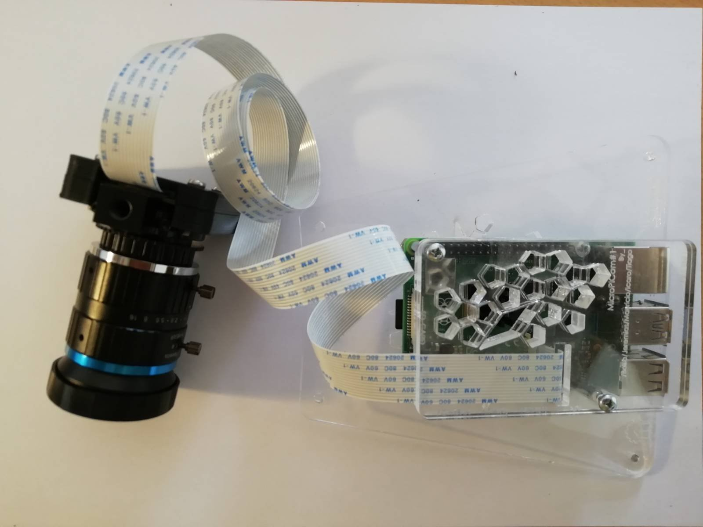

cameraPi web
========
cameraPi web, is a free, open-source web application for the raspberry to be able to capture high resolution still images from a camera and to stream video, remotely or locally using a web browser.

## releases

* [last release v0.3](https://gitlab.com/pgouveia/camerapi-web/-/tags/0.3)

* [all releases](https://gitlab.com/pgouveia/camerapi-web/-/tags/)

## Installation
 `$ git clone https://gitlab.com/pgouveia/camerapi-web.git`

 `$ ./start.sh`

probably you'll need to install some missing packages.

## Contributing

cameraPi web is **free, open-source software** licensed under **AGPLv3**.

You can open issues for bugs you've found or features you think are missing. You can also submit merge requests to this repository.

## Example image

